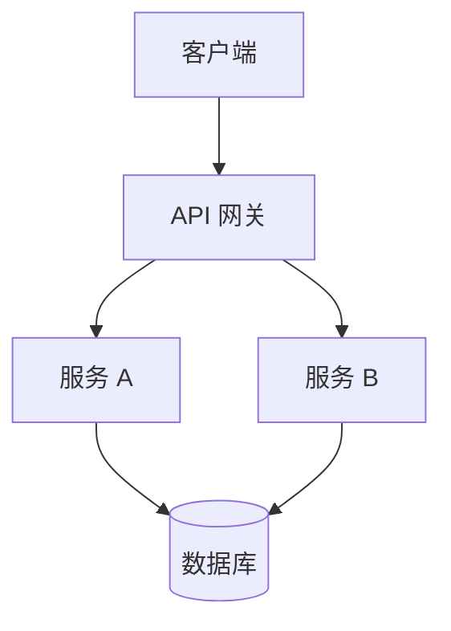

# 代码文档技能

## 概述

本技能为软件项目、代码库、库和 API 生成专业、全面的文档。它遵循 React、Django、Stripe 和 Kubernetes 等项目的行业最佳实践，产生对新贡献者和有经验的开发者都有用、准确、结构良好且有用的文档。

输出范围从单文件 README 到多文档开发者指南，始终与项目复杂度和用户需求相匹配。

## 核心能力

- 生成带有徽章、安装、使用和 API 参考的全面 README.md 文件
- 从源代码分析创建 API 参考文档
- 生成带图表的架构和设计文档
- 编写开发者入职和贡献指南
- 从提交历史或发布说明生成变更日志
- 遵循特定语言约定的内联代码文档
- 支持 JSDoc、docstrings、GoDoc、Javadoc 和 Rustdoc 格式
- 适应项目语言和生态系统的文档风格

## 何时使用此技能

**始终加载此技能当：**

- 用户要求"记录"、"创建文档"或"编写文档"用于任何代码
- 用户请求 README、API 参考或开发者指南
- 用户分享代码库或仓库并想要生成文档
- 用户要求改进或更新现有文档
- 用户需要架构文档，包括图表
- 用户请求变更日志或迁移指南

## 文档工作流程

### 第一阶段：代码库分析

在编写任何文档之前，彻底了解代码库。

#### 步骤 1.1：项目发现

识别项目基本信息：

| 字段 | 如何确定 |
|-------|-----------------|
| **语言** | 检查文件扩展名、`package.json`、`pyproject.toml`、`go.mod`、`Cargo.toml` 等 |
| **框架** | 查看依赖项中的已知框架（React、Django、Express、Spring 等） |
| **构建系统** | 检查 `Makefile`、`CMakeLists.txt`、`webpack.config.js`、`build.gradle` 等 |
| **包管理器** | npm/yarn/pnpm、pip/uv/poetry、cargo、go modules 等 |
| **项目结构** | 映射目录树以了解架构 |
| **入口点** | 找到主文件、CLI 入口点、导出模块 |
| **现有文档** | 检查现有 README、docs/、wiki 或内联文档 |

#### 步骤 1.2：代码结构分析

使用沙箱工具探索代码库：

```bash
# 获取目录结构
ls /mnt/user-data/uploads/project-dir/

# 读取关键文件
read_file /mnt/user-data/uploads/project-dir/package.json
read_file /mnt/user-data/uploads/project-dir/pyproject.toml

# 搜索公共 API 表面
grep -r "export " /mnt/user-data/uploads/project-dir/src/
grep -r "def " /mnt/user-data/uploads/project-dir/src/ --include="*.py"
grep -r "func " /mnt/user-data/uploads/project-dir/ --include="*.go"
```

#### 步骤 1.3：识别文档范围

根据分析，确定要生成的文档：

| 项目规模 | 推荐的文档 |
|-------------|--------------------------|
| **单文件/脚本** | 内联注释 + 使用标题 |
| **小型库** | 带 API 参考的 README |
| **中型项目** | README + API 文档 + 示例 |
| **大型项目** | README + 架构 + API + 贡献 + 变更日志 |

### 第二阶段：文档生成

#### 步骤 2.1：README 生成

每个项目都需要 README。遵循此结构：

```markdown
# 项目名称

[一行项目描述 — 它做什么以及为什么重要]

[](#) [](#)

## 特性

- [关键特性 1 — 简要描述]
- [关键特性 2 — 简要描述]
- [关键特性 3 — 简要描述]

## 快速开始

### 先决条件

- [带版本要求的先决条件 1]
- [带版本要求的先决条件 2]

### 安装

[带有复制粘贴就绪代码块的安装命令]

### 基本用法

[展示核心功能的最小工作示例]

## 文档

- [链接到单独的完整 API 参考（如果有）]
- [链接到架构文档（如果有）]
- [链接到示例目录（如果适用）]

## API 参考

[对于较小项目为内联 API 参考，或链接到生成的文档]

## 配置

[环境变量、配置文件或运行时选项]

## 示例

[2-3 个涵盖常见用例的实际示例]

## 开发

### 设置

[如何设置开发环境]

### 测试

[如何运行测试]

### 构建

[如何构建项目]

## 贡献

[贡献指南或指向 CONTRIBUTING.md 的链接]

## 许可证

[许可证信息]
```

#### 步骤 2.2：API 参考生成

对于每个公共 API 表面，记录：

**函数/方法文档**：

```markdown
### `functionName(param1, param2, options?)`

简要描述此函数的作用。

**参数：**

| 参数 | 类型 | 必填 | 默认值 | 描述 |
|-----------|------|----------|---------|-------------|
| `param1` | `string` | 是 | — | param1 的描述 |
| `param2` | `number` | 是 | — | param2 的描述 |
| `options` | `Object` | 否 | `{}` | 配置选项 |
| `options.timeout` | `number` | 否 | `5000` | 超时毫秒数 |

**返回：** `Promise<Result>` — 返回值描述

**抛出：**
- `ValidationError` — 当 param1 为空时
- `TimeoutError` — 当操作超过超时时

**示例：**

```javascript
const result = await functionName("hello", 42, { timeout: 10000 });
console.log(result.data);
```
```

**类文档**：

```markdown
### `ClassName`

类的简要描述及其目的。

**构造函数：**

```javascript
new ClassName(config)
```

| 参数 | 类型 | 描述 |
|-----------|------|-------------|
| `config.option1` | `string` | 描述 |
| `config.option2` | `boolean` | 描述 |

**方法：**

- [`method1()`](#method1) — 简要描述
- [`method2(param)`](#method2) — 简要描述

**属性：**

| 属性 | 类型 | 描述 |
|----------|------|-------------|
| `property1` | `string` | 描述 |
| `property2` | `number` | 只读。描述 |
```

#### 步骤 2.3：架构文档

对于中大型项目，包含架构文档：

```markdown
# 架构概述

## 系统图

[包含显示高级架构的 Mermaid 图表]



## 组件概述

### 组件名称
- **目的**：此组件做什么
- **位置**：`src/components/name/`
- **依赖**：它依赖什么
- **公共 API**：关键导出或接口

## 数据流

[描述关键操作的数据如何流经系统]

## 设计决策

### 决策标题
- **上下文**：导致此决策的情况
- **决策**：决定了什么
- **理由**：为什么选择这种方法
- **权衡**：牺牲了什么
```

#### 步骤 2.4：内联代码文档

生成特定语言的内联文档：

**Python（docstrings — Google 风格）**：
```python
def process_data(input_path: str, options: dict | None = None) -> ProcessResult:
    """从给定文件路径处理数据。

    读取输入文件，根据提供的选项应用转换，
    并返回结构化结果对象。

    参数:
        input_path: 输入数据文件的绝对路径。
            支持 CSV、JSON 和 Parquet 格式。
        options: 可选的配置字典。
            - "validate" (bool): 启用输入验证。默认为 True。
            - "format" (str): 输出格式（"json" 或 "csv"）。默认为 "json"。

    返回:
        包含转换后数据和元数据的 ProcessResult。

    抛出:
        FileNotFoundError: 当 input_path 不存在时。
        ValidationError: 当启用验证且数据格式不正确时。

    示例:
        >>> result = process_data("/data/input.csv", {"validate": True})
        >>> print(result.row_count)
        1500
    """
```

**TypeScript（JSDoc / TSDoc）**：
```typescript
/**
 * 从 API 获取用户数据并转换为显示格式。
 *
 * @param userId - 用户的唯一标识符
 * @param options - 获取操作的配置选项
 * @param options.includeProfile - 是否包含完整配置文件。默认为 `false`。
 * @param options.cache - 缓存持续时间（秒）。设置为 `0` 可禁用。
 * @returns 准备好渲染的转换后用户数据
 * @throws {NotFoundError} 当用户 ID 不存在时
 * @throws {NetworkError} 当 API 无法访问时
 *
 * @示例
 * ```ts
 * const user = await fetchUser("usr_123", { includeProfile: true });
 * console.log(user.displayName);
 * ```
 */
```

**Go（GoDoc）**：
```go
// ProcessData 读取给定路径的输入文件，应用指定的
// 转换，并返回处理结果。
//
// 输入路径必须是 CSV 或 JSON 文件的绝对路径。
// 如果 options 为 nil，则使用默认选项。
//
// 如果文件不存在或无法解析，ProcessData 返回错误。
func ProcessData(inputPath string, options *ProcessOptions) (*Result, error) {
```

### 第三阶段：质量保证

#### 步骤 3.1：文档完整性检查

验证文档涵盖：

- [ ] **它是什么** — 新手可以理解的清晰项目描述
- [ ] **为什么存在** — 它解决的问题和价值主张
- [ ] **如何安装** — 复制粘贴就绪的安装命令
- [ ] **如何使用** — 至少一个展示核心功能的最小工作示例
- [ ] **API 表面** — 所有公共函数、类和类型都有文档
- [ ] **配置** — 所有环境变量、配置文件和选项
- [ ] **错误处理** — 常见错误及如何解决
- [ ] **贡献** — 如何设置开发环境并提交更改

#### 步骤 3.2：质量标准

| 标准 | 检查 |
|----------|-------|
| **准确性** | 每个代码示例必须与描述的 API 实际配合使用 |
| **完整性** | 没有未记录公共 API 表面 |
| **一致性** | 整个文档格式和结构相同 |
| **新鲜度** | 文档与当前代码匹配，而非旧版本 |
| **可访问性** | 没有未解释的术语，首字母缩写在首次使用时定义 |
| **示例** | 每个复杂概念至少有一个实际示例 |

#### 步骤 3.3：交叉引用验证

确保：
- 所有提到的文件路径存在于项目中
- 所有引用的函数和类存在于代码中
- 所有代码示例使用正确的函数签名
- 版本号与项目的实际版本匹配
- 所有链接（内部和外部）都有效

## 文档风格指南

### 写作原则

1. **先说"为什么"** — 在解释某事如何工作之前，先解释为什么存在
2. **渐进式披露** — 从简单开始，逐渐增加复杂性
3. **展示，不要讲述** — 优先使用代码示例而非冗长解释
4. **主动语态** — "函数返回 X"而非"X 被函数返回"
5. **现在时态** — "服务器在端口 8080 上启动"而非"服务器将在端口 8080 上启动"
6. **第二人称** — "你可以配置..."而非"用户可以配置..."

### 格式规则

- 使用 ATX 风格标题（`#`、`##`、`###`）
- 使用带语言规范的有围栏代码块（` ```python `、` ```bash `）
- 使用表格表示结构化信息（参数、选项、配置）
- 使用提示块表示重要说明、警告和提示
- 保持行长度可读（源中约 80-100 个字符换行）
- 对函数名、文件路径、变量名和 CLI 命令使用 `代码格式`

### 特定语言约定

| 语言 | 文档格式 | 风格指南 |
|----------|-----------|-------------|
| Python | Google 风格 docstrings | PEP 257 |
| TypeScript/JavaScript | TSDoc / JSDoc | TypeDoc 约定 |
| Go | GoDoc 注释 | Effective Go |
| Rust | Rustdoc (`///`) | Rust API 指南 |
| Java | Javadoc | Oracle Javadoc 指南 |
| C/C++ | Doxygen | Doxygen 手册 |

## 输出处理

生成后：

- 将文档文件保存到 `/mnt/user-data/outputs/`
- 对于多文件文档，保持项目目录结构
- 使用 `present_files` 工具向用户展示生成的文件
- 提供迭代特定部分或调整细节级别的选项
- 建议可能有价值的其他文档

## 注意事项

- 在编写文档之前始终分析实际代码 — 不要猜测 API 签名或行为
- 当现有文档存在时，保留其结构，除非用户明确要求重写
- 对于大型代码库，首先优先记录公共 API 表面和关键抽象
- 文档应使用与项目现有文档相同的语言编写；如果不存在，默认为英语
- 生成变更日志时，使用 [Keep a Changelog](https://keepachangelog.com/) 格式
- 此技能与 `deep-research` 技能结合使用效果很好，用于记录第三方集成或依赖
